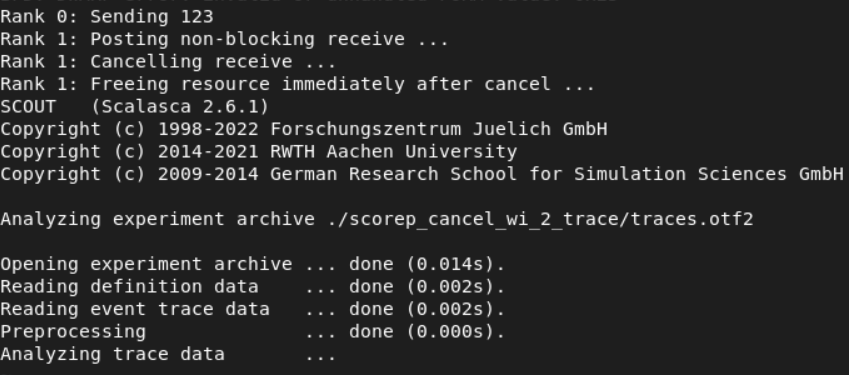
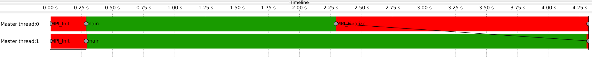
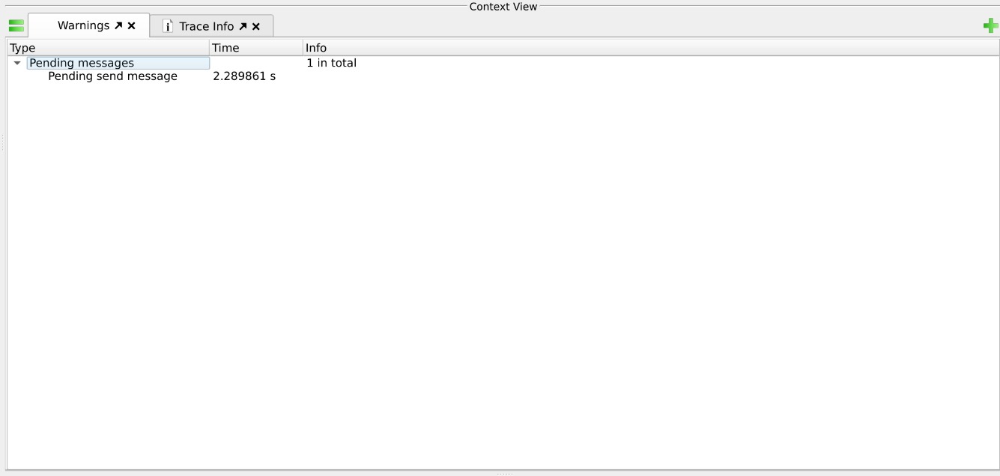
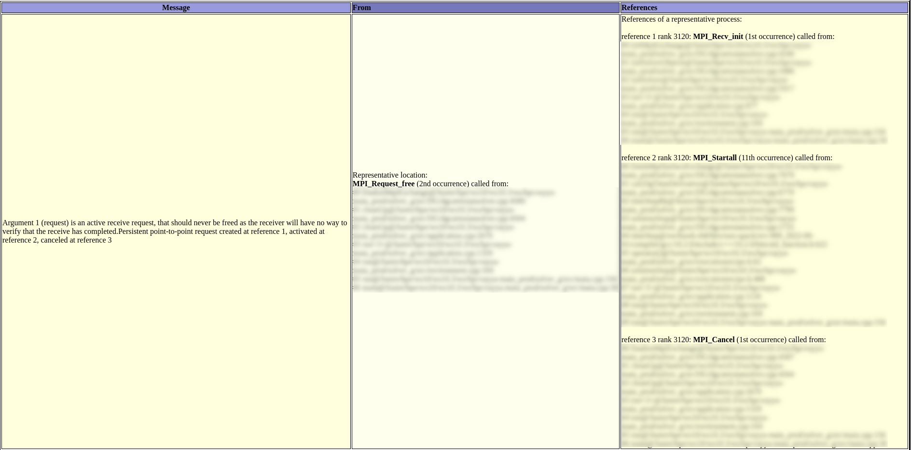

# MPI-pending-comm
Provoke MPI pending communication between processes. A case study in MPI correctness.

`cancel_pattern.c` describes a pattern in MPI communication that causes pending messages that could cause issues in trace replay.

## Description

Compiling and execute the above code without instrumentation. For instance,
```
mpicc cancel_pattern.c -o cancel_pattern
mpirun -np 2 ./cancel_pattern

```
works without errors.

However, if you instrument the above code with Score-P and use Scalasca for post processing,
```
scorep-mpicc cancel_pattern.c -o cancel_pattern_scorep
scan -t mpirun -np 2 ./cancel_pattern_scorep

```
Only partial output is produced i.e only trace files are produced but the parallel trace analyzer (in this case `scout.mpi` is called under the hood with `scan`) that usually does the post processing of traces to identify wait-states, critical path etc. hangs without producing the final `trace.cubex` file.

In this case, the standard output may look like this




Since the trace files are produced, one might visualize them using [Vampir](https://vampir.eu/). The timeline for this code is as shown below




The observed behaviour of pending messages can be viewed as warnings in Vampir



## Reason for pending messages
This program was deliberately written to provoke pending communication, that disrupts performance tools. `MPI_Cancel` is a local call and returns immediately, likely before the communication is actually cancelled, i.e the corresponding request could be still **active**. `MPI_Request_free` is encouraged to be used only on **inactive** requests. Also, no error code is returned back to the user in case one occurs. 

## Solution 
Calling `MPI_Wait` after `MPI_Cancel` allows the operation to complete and will resolve this problem. Consistent trace analysis is then possible.
This pattern could occur anywhere and serves as a good case study in MPI Correctness.

## Suggestion
To analyze MPI Correctness of your application which show problems with patterns similar to what was described here, one could use a tool like [MUST](https://www.i12.rwth-aachen.de/cms/i12/forschung/forschungsschwerpunkte/lehrstuhl-fuer-hochleistungsrechnen/~nrbe/must/)

To demonstrate the tool's features when it comes across patterns explained above, below is an excerpt from the report produced by MUST on a production code

